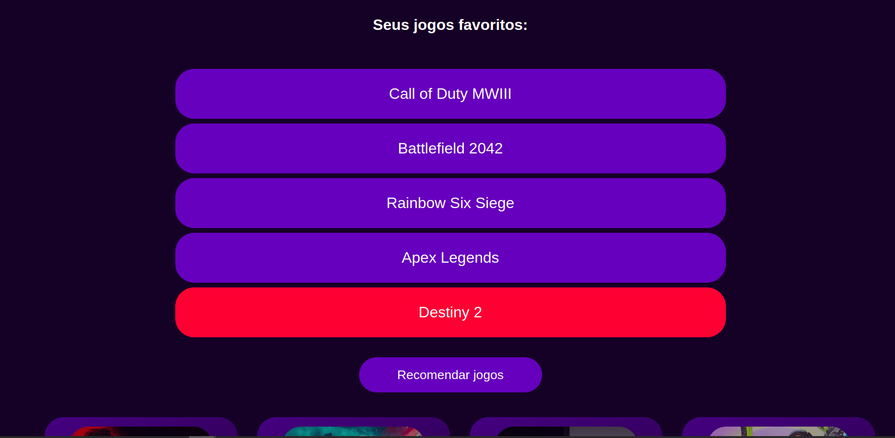
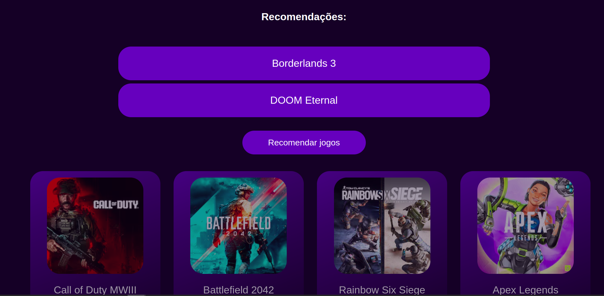

# Recomenda Jogos

**Conteúdo da Disciplina**: Dividir e Conquistar<br>

## Alunos

| Matrícula   | Aluno                        |
| ----------- | ---------------------------- |
| 21/1039662  | Pedro Henrique da Silva Melo |
| 20/2063300  | João Pedro Rodrigues Morbeck |

## Sobre 
O recomenda jogos é uma aplicação que utiliza do algoritmo de contagem de inversões para que possa recomendar jogos que venham a ser de interesse do gosto do usuário e do gênero desses jogos. Para isso, ele recomenda que o usuário insira até 5 jogos de sua preferência, sendo que o primeiro jogo é aquele que o usuário mais gosta e o quinto jogo é o quinto que ele mais gosta. A partir disso, o algoritmo retorna 3 jogos que são recomendados para o usuário.

O vídeo de apresentação pode ser encontrado no seguinte [link](./video/entrega_dividir-e-conquistar.mp4)

## Screenshots
<center>


Tela inicial da aplicação
</center>

<center>



Adicionando jogos favoritos
</center>

<center>



Recomendação de jogos
</center>

## Instalação 
**Linguagem**: Javascript<br>
**Framework**: React.js<br>

É necessário ter Node.js instalado (recomendado versão 18 ou posterior) que pode ser baixado [aqui](https://nodejs.org/en), na pasta do projeto, execute o seguinte comando.

``` bash
npm install
```

``` bash
npm run dev
```

o projeto estará no https://localhost:5173

## Uso 
O algoritmo primeiramente gera uma lista de 28 jogos de acordo com a base de dados criada, tendo 7 jogos de 4 gêneros diferentes. O usuário pode escolher até 5 jogos que mais gosta para poder ter recomendações de até 2 jogos diferentes para que ele possa jogar. O usuário pode optar por remover jogos favoritos também e com isso ir montando diversas listas que podem ter recomendações diferentes, a partir do gosto do usuário.

